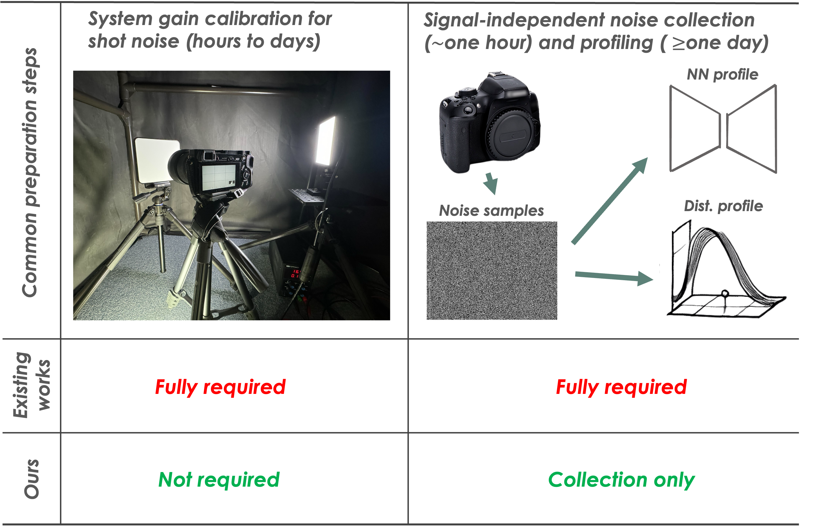

# Noise Modeling in One Hour: Minimizing Preparation Efforts for Self-supervised Low-Light RAW Image Denoising

#### Official repository for the CVPR'25 paper: 
#### [Noise Modeling in One Hour: Minimizing Preparation Efforts for Self-supervised Low-Light RAW Image Denoising (WIP)]()
##### [Feiran Li (Sony Research)](https://sites.google.com/view/feiranlihomepage/home), Haiyang Jiang (Tokyo University), [Daisuke Iso (Sony Research)](https://ai.sony/people/Daisuke-Iso/)

## Overview
Noise synthesis is a promising solution for addressing the data shortage problem in data-driven low-light RAW image denoising. However, accurate noise synthesis methods often necessitate labor-intensive calibration and profiling procedures during preparation, preventing them from landing to practice at scale. This work introduces a practically simple noise synthesis pipeline based on detailed analyses of noise properties and extensive justification of widespread techniques. Compared to other approaches, our proposed pipeline eliminates the cumbersome system gain calibration and signal-independent noise profiling steps, reducing the preparation time for noise synthesis from days to hours. Meanwhile, our method exhibits strong denoising performance, showing an up to $0.54\mathrm{dB}$ PSNR improvement over the current state-of-the-art noise synthesis technique.

<!--  -->

<p align="center">
  
</p>

## Installation
Clone the repository and install necessary dependencies with `pip install -r requirements.txt`


## Test our pretrained model
**We follow [PMN](https://github.com/megvii-research/PMN/tree/TPAMI) for dataset preparation**

**STEP 1: Download datasets and processing them:**

* [ELD (11.46 GB)](https://drive.google.com/file/d/13Ge6-FY9RMPrvGiPvw7O4KS3LNfUXqEX/view?usp=sharing), [SID (25 GB)](https://storage.googleapis.com/isl-datasets/SID/Sony.zip), [LRID (523 GB)](https://pan.baidu.com/s/1fXlb-Q_ofHOtVOufe5cwDg?pwd=vmcl)

* Use `get_dataset_infos.py` to generate evaluation dataset infos (please modify `--root_dir` to anchor the dataset location). This script will generate dataset info to the `infos` folder.
```bash 
# Evaluate
python3 get_dataset_infos.py --dstname ELD --root_dir /data/ELD --mode SonyA7S2
python3 get_dataset_infos.py --dstname SID --root_dir /data/SID/Sony --mode evaltest
python3 get_dataset_infos.py --dstname LRID --root_dir /data/LRID
```

**STEP 2: Download necessary files:**
* Download [pretrained checkpoints](https://drive.google.com/drive/folders/1KyR9f6SIciXWv29owm0xYPCOnaMd9YWh?usp=sharing) and put them into the `checkpoints` folder.
* Download [pre-computed dark shadings](https://drive.google.com/drive/folders/18YUiNsSH-YR9L5KJZGP23-DsOvJC0JWz?usp=sharing) and put them into the `resources` folder.


**STEP 3: Run the evaluation:**
```bash 
# SID and ELD datasets (SonyA7S2 DSLR)
python3 test_denoise_sideld.py
# LRID dataset (Redmi smartphone)
python3 test_denoise_lrid.py 
```


## Acknowledgements
We would like to thank previous open-source efforts that we utilize in our code, in particular, the [PMN](https://github.com/megvii-research/PMN/tree/TPAMI) implementation.


## BibTeX
```bibtex
@inproceedings{li2025NoiseModeling,
    author = {Li, Feiran and Jiang, Haiyang and Iso, Daisuke},
    title = {Noise Modeling in One Hour: Minimizing Preparation Efforts for Self-supervised Low-Light RAW Image Denoising},
    booktitle = {Proceedings of the IEEE Conference on Computer Vision and Pattern Recognition},
    year = {2025}
}
```
